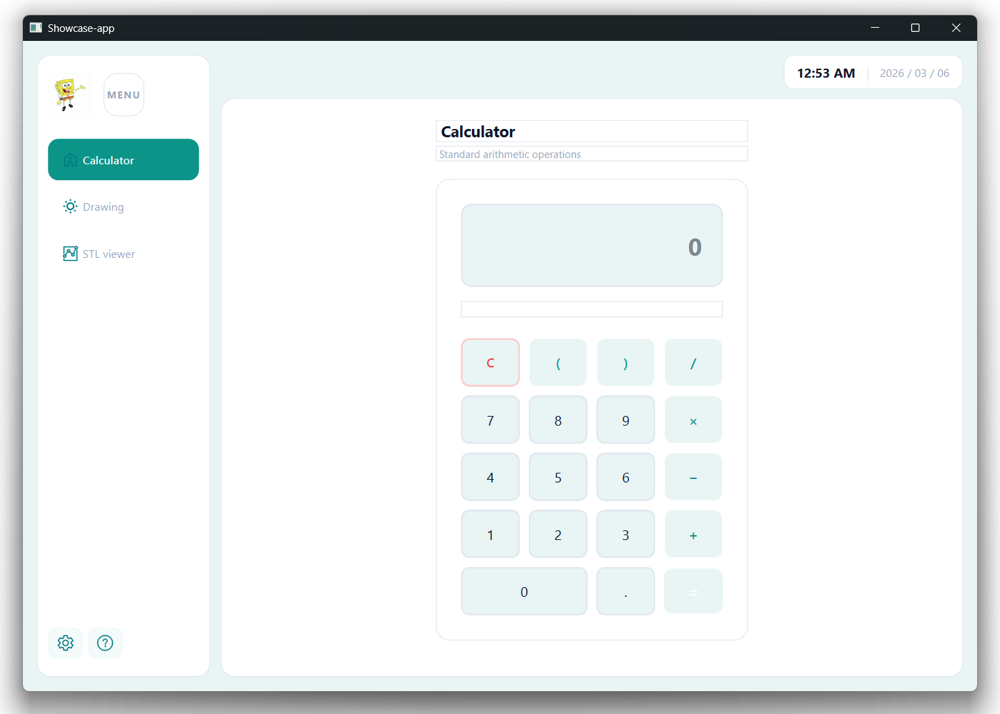
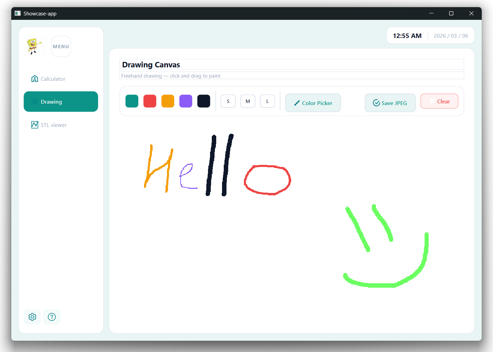
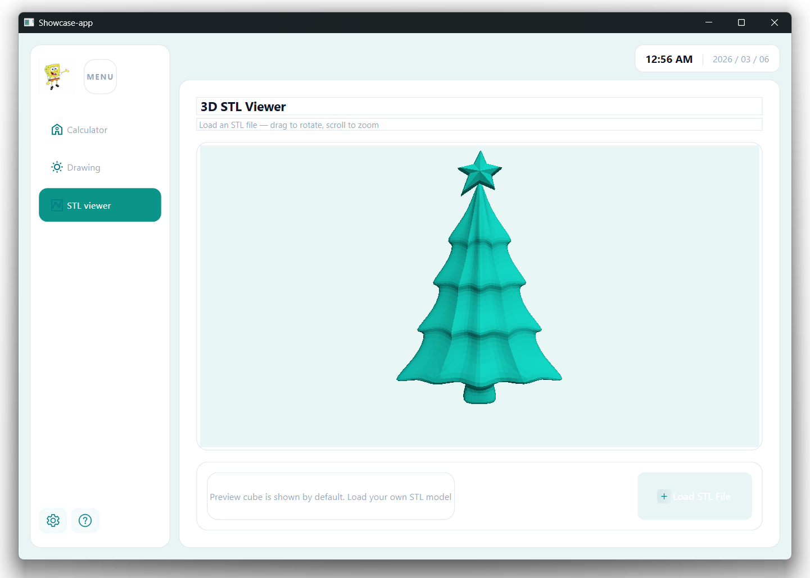

# Showcase App

A multi-tab desktop application built with PySide6 and OpenGL, featuring a Calculator, a Drawing canvas, and a 3D STL Viewer.

---

## Requirements

- Python 3.10 or 3.11 (verified on 3.10.10)
- pip

---

## Installation

### 1. Clone or download the project

```bash
git clone https://github.com/up99/showcase-app.git
cd dashboard-app
```

### 2. Create a virtual environment

```bash
# Windows
python -m venv venv
venv\Scripts\activate
# or venv\Scripts\Activate.ps1

# macOS / Linux
python3 -m venv venv
source venv/bin/activate
```

### 3. Install dependencies

```bash
pip install -r requirements.txt
```

---

## Running the App

```bash
python main.py
```

No arguments needed.

---

## Project Structure

```
showcase-app/
├── main.py            # Entry point
├── requirements.txt   # Python dependencies
├── apps/              # inner apps
├── stl-example/       # STL sample file
├── icons/             # SVG icons used in the app
└── screenshot/
    ├── calculator.png
    ├── drawing.png
    └── stl_viewer.png
```

---

## Tabs

| Tab | Description |
|---|---|
| **Calculator** | Standard arithmetic with keyboard support. Only valid characters are accepted. Results are rounded to 3 decimal places. |

| **Drawing** | Freehand canvas with color picker, brush sizes, and JPEG export. |

| **3D STL Viewer** | Load and rotate STL models. Drag to rotate, scroll to zoom. |


---

## Theme Customization

All colors, font sizes, border radii, and spacing values are stored in `apps/base/theme.json`. You can edit it without touching any Python code:

```json
{
  "colors": {
    "teal_primary": "#0D9488",
    "bg_app": "#E8F5F4"
  }
}
```

Restart the app after saving changes.

---

## (Especially for interested users) Building a Standalone Executable with PyInstaller

You can package the app into a single `.exe` (Windows) or binary (macOS/Linux) using PyInstaller.

### 1. Install PyInstaller

```bash
pip install pyinstaller
```

### 2. Basic build

```bash
pyinstaller --onefile --windowed main.py
```

- `--onefile` — bundles everything into a single executable file
- `--windowed` — hides the terminal window on launch (Windows/macOS)

The output will be in the `dist/` folder.

### 3. Include icons and theme files

The app loads external files like `theme.json` or `icons/`, so there is a need to tell PyInstaller to bundle them:

```bash
pyinstaller --onefile --windowed \
  --add-data "theme.json;." \
  --add-data "icons;icons" \
  main.py
```

> On macOS/Linux use `:` as separator instead of `;`:
> ```bash
> --add-data "theme.json:." --add-data "icons:icons"
> ```
